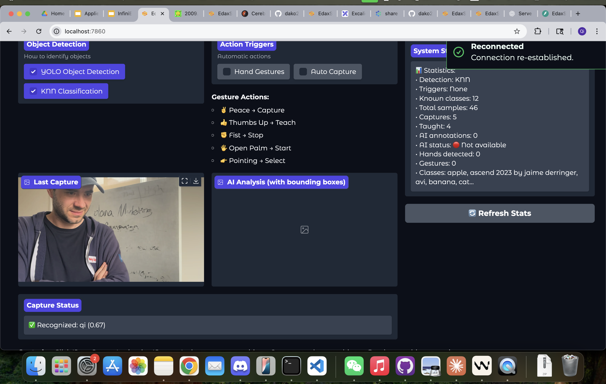
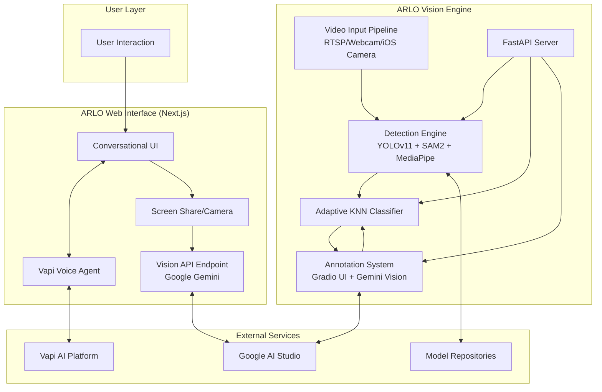

<div align="center">



# ARLO: Audio-visual Reinforcement Learning Optimizer


**A multimodal AI system that sees, hears, and learns in real-time**

*Combining conversational AI with powerful computer vision for continuous, on-the-fly optimization and learning*

[Live Demo](#demos) • [Documentation](#documentation) • [API Reference](#api-reference) • [Contributing](#contributing)

</div>

---

## Overview

ARLO is a groundbreaking multimodal AI ecosystem that seamlessly integrates conversational interfaces with advanced computer vision capabilities. The system demonstrates the future of adaptive AI by continuously learning from visual input while maintaining natural, context-aware conversations.

The platform consists of three synergistic components working in harmony to create an intelligent system that can perceive, understand, and adapt to its environment in real-time.

## 🚀 Key Features

### 🗣️ Multimodal Conversational Intelligence
- **Real-time Voice Chat**: Low-latency conversations powered by Vapi AI
- **Visual Context Integration**: AI analyzes screen shares and camera feeds using Google's Gemini API
- **Specialized Agents**: Purpose-built agents for conversation, booking, scheduling, and entertainment
- **Cross-Modal Understanding**: Seamless integration of visual and auditory information

### 👁️ Advanced Computer Vision Engine
- **Real-time Object Detection**: YOLOv11-powered detection on live video streams (RTSP/webcam)
- **Interactive Segmentation**: SAM2 (Segment Anything Model 2) for precise, prompt-based object isolation
- **Hand & Gesture Tracking**: MediaPipe integration for detailed gesture recognition and interaction
- **Multi-stream Processing**: Simultaneous handling of multiple video sources

### 🧠 Continuous Learning System
- **Teach-and-Learn Interface**: Show the AI new objects and provide labels instantly
- **Adaptive KNN Classification**: Zero-downtime learning without model retraining
- **AI-Powered Annotation**: Automatic labeling suggestions using Gemini Vision
- **Self-Improving Feedback Loop**: Every annotation enriches the dataset for progressive improvement

### 🌐 Cross-Platform Architecture
- **Web Interface**: Responsive Next.js application accessible from any browser
- **Python Engine**: Robust backend deployable on servers, desktops, or edge devices
- **Native iOS App**: Swift implementation showcasing mobile capabilities
- **REST API**: FastAPI server exposing all vision capabilities for third-party integration

## 🏗️ System Architecture



**Core Technology Stack:**

| Component | Technology | Purpose |
|-----------|------------|---------|
| **Frontend** | Next.js 15 | Modern React framework with server components |
| **Language** | TypeScript | Type safety and developer productivity |
| **Vision Engine** | Python 3.11 | High-performance computer vision processing |
| **Object Detection** | YOLOv11 | Real-time object detection and classification |
| **Segmentation** | SAM2 | Interactive and prompt-based object segmentation |
| **Hand Tracking** | MediaPipe | Gesture recognition and hand landmark detection |
| **Voice AI** | Vapi | Low-latency voice conversation capabilities |
| **Vision AI** | Google Gemini | Visual understanding and annotation |
| **API Framework** | FastAPI | High-performance REST API server |
| **Mobile** | Swift 5 | Native iOS implementation |
| **Annotation UI** | Gradio | Interactive model training interface |

## 🚀 Quick Start

### Prerequisites

**System Requirements:**
- **Python 3.11+** with pip or uv
- **Node.js 18+** with npm/yarn
- **Webcam or RTSP stream** for vision engine
- **Modern browser** with microphone support

**API Keys Required:**
- **Vapi AI**: Get from [vapi.ai](https://vapi.ai)
- **Google AI Studio**: Get from [aistudio.google.com](https://aistudio.google.com)

### 1. ARLO Web Interface Setup

The web interface provides the quickest way to experience ARLO's multimodal conversational capabilities.

```bash
# Clone repository
git clone https://github.com/your-org/ARLO.git
cd ARLO

# Install dependencies
npm install

# Configure environment
cp .env.example .env.local
```

**Environment Configuration:**
```env
# Vapi AI Configuration
NEXT_PUBLIC_VAPI_PUBLIC_KEY=your_vapi_public_key
NEXT_PUBLIC_VAPI_ASSISTANT_ID=your_vapi_assistant_id

# Google AI Configuration (Server-side)
GOOGLE_API_KEY=your_google_ai_api_key

# Optional: Vision Engine Integration
ARLO_ENGINE_API_URL=http://localhost:8000
```

**Start Development Server:**
```bash
npm run dev
# Open http://localhost:3000
```

### 2. ARLO Vision Engine Setup

The Python engine provides core computer vision and continuous learning capabilities.

```bash
# Navigate to Python directory
cd python

# Install using uv (recommended)
pip install uv
uv venv
uv pip sync -r requirements.txt
source .venv/bin/activate  # On Windows: .venv\Scripts\activate

# Download required models
python download_yolo.py

# Set up environment variables
export GEMINI_API_KEY=your_gemini_api_key
```

**Run Vision Engine:**
```bash
# CLI interface with OpenCV visualization
python main.py --url 0  # Use webcam
python main.py --url rtsp://your-stream-url  # Use RTSP stream

# FastAPI server for integration
python api_server.py
# API available at http://localhost:8000
# Documentation at http://localhost:8000/docs
```

### 3. Native iOS App Setup

```bash
cd swift
open ARLO-iOS.xcodeproj
# Build and run on iOS device or simulator
```

## 📱 Usage Guide

### Web Interface Experience

1. **Start Conversation**
   - Navigate to `http://localhost:3000`
   - Go to Voice Agent (`/voice-agent`) or Original Agent (`/voice-agent-original`)
   - Grant microphone and camera/screen sharing permissions
   - Click "Start" to begin conversation

2. **Multimodal Interaction**
   - The AI automatically analyzes your screen or camera feed
   - Visual context is integrated into voice conversations
   - Ask questions about what the AI sees
   - Experience seamless audio-visual AI interaction

### Vision Engine Interface

1. **Real-time Detection**
   ```bash
   python main.py --url 0
   ```
   - Live video feed with YOLO detections
   - Real-time object classification
   - Performance metrics overlay

2. **Interactive Learning**
   - **Press `s`**: Capture and classify the dominant object
   - **Unknown objects**: Automatically saved to `captures/failed/`
   - **Annotation**: Open `http://localhost:7860` to label unknown objects
   - **Instant learning**: KNN model retrains immediately

3. **System Controls**
   - **Press `i`**: View system statistics and performance metrics
   - **Press `r`**: Reset KNN model memory
   - **Press `q`**: Quit application gracefully

### API Integration

```python
import requests

# Detect objects in image
response = requests.post(
    "http://localhost:8000/detect",
    files={"file": open("image.jpg", "rb")}
)

# Classify object
response = requests.post(
    "http://localhost:8000/classify",
    files={"file": open("object.jpg", "rb")}
)

# Add new training sample
response = requests.post(
    "http://localhost:8000/learn",
    files={"file": open("new_object.jpg", "rb")},
    data={"label": "my_new_object"}
)
```

## 📂 Project Structure

```
ARLO/
├── README.md                    # This file
├── package.json                 # Node.js dependencies
├── next.config.js              # Next.js configuration
├── tailwind.config.js          # Styling configuration
├── 
├── app/                        # Next.js App Router
│   ├── page.tsx               # Landing page
│   ├── voice-agent/           # Voice agent interfaces
│   └── api/                   # API routes
│
├── components/                 # React components
│   ├── ui/                    # Base UI components
│   ├── voice/                 # Voice interface components
│   └── vision/                # Vision integration components
│
├── lib/                       # Utilities and helpers
│   ├── vapi-client.ts         # Vapi AI integration
│   └── gemini-client.ts       # Google AI integration
│
├── python/                    # ARLO Vision Engine
│   ├── main.py               # CLI application
│   ├── api_server.py         # FastAPI server
│   ├── download_yolo.py      # Model downloader
│   ├── requirements.txt      # Python dependencies
│   │
│   ├── src/                  # Core engine modules
│   │   ├── detection/        # Object detection pipeline
│   │   ├── classification/   # KNN adaptive classifier
│   │   ├── annotation/       # Human-in-the-loop labeling
│   │   ├── streaming/        # Video stream processing
│   │   └── api/             # FastAPI route handlers
│   │
│   ├── models/              # Downloaded AI models
│   ├── data/               # Training data and annotations
│   ├── captures/           # Captured frames and samples
│   │   ├── successful/     # Successfully classified objects
│   │   └── failed/        # Unknown objects for labeling
│   │
│   └── notebooks/          # Jupyter notebooks for experimentation
│
├── swift/                  # Native iOS Application
│   ├── ARLO-iOS.xcodeproj # Xcode project
│   ├── Sources/           # Swift source files
│   ├── Resources/         # App resources and assets
│   └── Tests/            # Unit and integration tests
│
└── docs/                  # Documentation
    ├── api-reference.md   # Complete API documentation
    ├── deployment.md     # Deployment guides
    └── examples/         # Integration examples
```

## 🔌 API Reference

### Vision Engine Endpoints

**Object Detection**
```http
POST /detect
Content-Type: multipart/form-data

file: image file
threshold: float (optional, default: 0.5)
```

**Object Classification**
```http
POST /classify
Content-Type: multipart/form-data

file: image file
```

**Continuous Learning**
```http
POST /learn
Content-Type: multipart/form-data

file: image file
label: string
```

**System Status**
```http
GET /health
GET /stats
GET /model-info
```

### Web Interface APIs

**Voice Agent Management**
```http
POST /api/voice/start
POST /api/voice/stop
GET  /api/voice/status
```

**Vision Integration**
```http
POST /api/vision/analyze
Content-Type: application/json

{
  "image_data": "base64_encoded_image",
  "context": "optional_context_string"
}
```

## 🧪 Testing & Quality Assurance

```bash
# Python engine tests
cd python
python -m pytest tests/ -v --cov=src

# Web interface tests
npm test
npm run test:e2e

# API integration tests
cd python
python -m pytest tests/test_api.py -v

# iOS app tests
cd swift
xcodebuild test -project ARLO-iOS.xcodeproj -scheme ARLO-iOS
```

## 🚀 Deployment

### Production Deployment Options

**1. Cloud Deployment (Recommended)**
```bash
# Deploy web interface to Vercel
vercel --prod

# Deploy vision engine to cloud compute
docker build -t arlo-engine python/
docker run -p 8000:8000 arlo-engine
```

**2. Edge Deployment**
```bash
# Deploy to NVIDIA Jetson or Raspberry Pi
cd python
pip install -r requirements-edge.txt
python main.py --device cuda  # or --device cpu
```

**3. Enterprise Deployment**
```bash
# Kubernetes deployment
kubectl apply -f k8s/
kubectl get pods -l app=arlo-engine
```

### Environment Variables (Production)

```env
# Web Interface
NEXT_PUBLIC_VAPI_PUBLIC_KEY=prod_vapi_key
GOOGLE_API_KEY=prod_google_key
ARLO_ENGINE_API_URL=https://your-engine.domain.com

# Vision Engine
GEMINI_API_KEY=prod_gemini_key
MODEL_CACHE_DIR=/app/models
DATA_STORAGE_PATH=/app/data
LOG_LEVEL=INFO
WORKERS=4
```

## 📊 Performance Metrics

### System Capabilities

| Metric | Performance | Notes |
|--------|-------------|-------|
| **Object Detection** | 30-60 FPS | Depends on hardware and model size |
| **Voice Latency** | < 300ms | End-to-end conversation response |
| **Learning Speed** | < 100ms | KNN classifier update time |
| **API Response** | < 50ms | Average endpoint response time |
| **Memory Usage** | < 2GB RAM | Typical operation with standard models |
| **Storage Growth** | ~10MB/day | With continuous learning enabled |

### Hardware Requirements

**Minimum (Development):**
- CPU: Intel i5 / AMD Ryzen 5
- RAM: 8GB
- GPU: Integrated graphics
- Storage: 10GB free space

**Recommended (Production):**
- CPU: Intel i7 / AMD Ryzen 7
- RAM: 16GB+
- GPU: NVIDIA RTX 3060+ or equivalent
- Storage: 50GB+ SSD

## 🗺️ Roadmap

### Phase 1: Integration & Polish (Q1 2025)
- [ ] **Complete Web/Engine Integration**: Direct connection between Next.js frontend and FastAPI backend
- [ ] **Enhanced Mobile App**: Full learning loop implementation in Swift
- [ ] **Performance Optimization**: GPU acceleration and model quantization
- [ ] **Documentation**: Comprehensive guides and tutorials

### Phase 2: Advanced Features (Q2 2025)
- [ ] **Federated Learning**: Distributed model synchronization across instances
- [ ] **Advanced Triggers**: Audio cues, complex gestures, and scene changes
- [ ] **Multi-Agent Orchestration**: Specialized AI agents for different domains
- [ ] **Real-time Collaboration**: Multi-user sessions with shared learning

### Phase 3: Enterprise & Scale (Q3 2025)
- [ ] **Enterprise Dashboard**: Management interface for multiple ARLO instances
- [ ] **Cloud Model Hub**: Centralized model sharing and versioning
- [ ] **Advanced Analytics**: Usage metrics, performance dashboards, and insights
- [ ] **Custom Deployment**: White-label solutions and enterprise customization

## 🤝 Contributing

We welcome contributions from developers, researchers, and AI enthusiasts! Whether you're fixing bugs, adding features, or improving documentation, your help makes ARLO better.

### Getting Started

1. **Fork the Repository**
   ```bash
   git clone https://github.com/your-username/ARLO.git
   cd ARLO
   ```

2. **Set Up Development Environment**
   ```bash
   # Python environment
   cd python && uv venv && uv pip sync -r requirements-dev.txt
   
   # Node.js environment
   cd .. && npm install
   ```

3. **Create Feature Branch**
   ```bash
   git checkout -b feature/amazing-improvement
   ```

4. **Make Your Changes**
   - Follow existing code style and patterns
   - Add tests for new functionality
   - Update documentation as needed

5. **Test Your Changes**
   ```bash
   # Python tests
   cd python && python -m pytest
   
   # Web interface tests
   npm test
   ```

6. **Submit Pull Request**
   - Use descriptive commit messages
   - Reference related issues
   - Include screenshots for UI changes

### Development Guidelines

- **Code Style**: Follow PEP 8 for Python, ESLint/Prettier for TypeScript
- **Testing**: Maintain test coverage above 80%
- **Documentation**: Update README and docs for new features
- **Performance**: Profile code changes for performance impact

## 📄 License

This project is licensed under the MIT License - see the [LICENSE](LICENSE) file for details.

## 🙏 Acknowledgments

- **[Ultralytics](https://ultralytics.com)**: For YOLOv11 object detection framework
- **[Meta AI](https://ai.meta.com)**: For SAM2 segmentation model
- **[Google](https://ai.google.dev)**: For MediaPipe and Gemini AI services
- **[Vapi](https://vapi.ai)**: For real-time voice AI capabilities
- **[Gradio](https://gradio.app)**: For intuitive ML interface components
- **[FastAPI](https://fastapi.tiangolo.com)**: For high-performance API framework
- **[Next.js](https://nextjs.org)**: For the amazing React framework
- **[Vercel](https://vercel.com)**: For seamless deployment platform

---

<div align="center">
  <strong>Ready to experience the future of multimodal AI?</strong><br>
  <a href="#quick-start">Get Started</a> • <a href="mailto:hello@arlo-ai.com">Contact Us</a> • <a href="https://github.com/your-org/ARLO/discussions">Join Discussion</a>
</div>
